<div align="center">

<!-- ░░ HERO — the signature writes itself inside an advanced terminal ░░ -->


<br/><br/>

<!-- ░░ live shell — reliable, ember-themed ░░ -->


<br/>


</div>

<br/>

<!-- ░░ ABOUT / neofetch — advanced terminal panel ░░ -->
<div align="center">

</div>

<br/>

<div align="center"><code>abhishek@kumawat ❯ ls ~/stack --impactful</code></div>

<br/>

<div align="center">


</div>

<br/>

<div align="center"><code>abhishek@kumawat ❯ git log --graph --contributions</code></div>

<br/>

<div align="center">


</div>

<br/>

<div align="center"><code>abhishek@kumawat ❯ ./connect.sh</code></div>

<br/>

<div align="center">

<a href="https://www.linkedin.com/in/abhishek-kumawat-7b90a6292/"></a>
<a href="https://github.com/abhishekkumawat-47"></a>
<a href="mailto:abhishekkumawat1008@gmail.com"></a>

</div>

<br/>

<!-- ░░ SIGN-OFF — the document, signed in the same hand ░░ -->
<div align="center">

```console
abhishek@kumawat:~$ exit
[ session closed ] — now go build something unforgettable.
```


<sub><code>~ crafted in ember & code · every pixel is a signature ~</code></sub>

</div>
