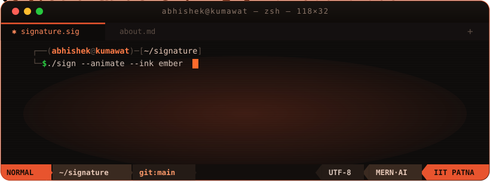
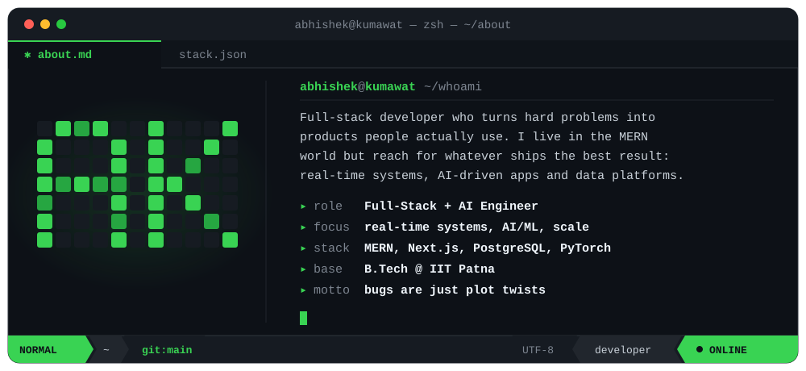

<div align="center">

<!-- ░░ HERO — the signature writes itself inside the terminal ░░ -->


<br/>

<!-- ░░ live shell ░░ -->


<br/>

<a href="https://github.com/abhishekkumawat-47?tab=followers"></a>


</div>

<br/>

<!-- ░░ WHOAMI — animated terminal panel ░░ -->
<div align="center">
<picture>
  <source media="(prefers-color-scheme: dark)" srcset="./about-dark.svg" />
  <source media="(prefers-color-scheme: light)" srcset="./about-light.svg" />
  
</picture>
</div>

<br/>

<div align="center"><code>abhishek@kumawat ❯ ls ~/stack --by-layer</code></div>

<br/>

<div align="center">
<table>
  <tr>
    <td align="right"><code>frontend</code></td>
    <td><picture><source media="(prefers-color-scheme: light)" srcset="https://skillicons.dev/icons?i=react,nextjs,ts,js,redux,tailwind,figma&theme=light" /></picture></td>
  </tr>
  <tr>
    <td align="right"><code>backend</code></td>
    <td><picture><source media="(prefers-color-scheme: light)" srcset="https://skillicons.dev/icons?i=nodejs,express,mongodb,postgres,prisma&theme=light" /></picture></td>
  </tr>
  <tr>
    <td align="right"><code>ai / ml</code></td>
    <td><picture><source media="(prefers-color-scheme: light)" srcset="https://skillicons.dev/icons?i=python,pytorch,tensorflow&theme=light" /></picture></td>
  </tr>
  <tr>
    <td align="right"><code>ship</code></td>
    <td><picture><source media="(prefers-color-scheme: light)" srcset="https://skillicons.dev/icons?i=docker,git,vercel&theme=light" /></picture></td>
  </tr>
</table>
</div>

<!-- ░░ SELECTED WORK — uncomment and fill in 2–4 of your best repos ░░
<br/>

<div align="center"><code>abhishek@kumawat ❯ ls ~/projects --pinned</code></div>

<br/>

| project | what it does | built with |
|:--|:--|:--|
| [**repo-name**](https://github.com/abhishekkumawat-47/repo-name) | one line on the problem it solves and a result | Next.js · Node · MongoDB |
| [**repo-name**](https://github.com/abhishekkumawat-47/repo-name) | one line on the problem it solves and a result | Python · PyTorch |
-->

<br/>

<div align="center"><code>abhishek@kumawat ❯ git log --graph --contributions</code></div>

<br/>

<div align="center">

<picture>
  <source media="(prefers-color-scheme: dark)" srcset="https://streak-stats.demolab.com/?user=abhishekkumawat-47&hide_border=true&background=0D1117&stroke=30363D&ring=39D353&fire=39D353&currStreakNum=F0F6FC&currStreakLabel=39D353&sideNums=F0F6FC&sideLabels=7D8590&dates=7D8590" />
  <source media="(prefers-color-scheme: light)" srcset="https://streak-stats.demolab.com/?user=abhishekkumawat-47&hide_border=true&background=FFFFFF&stroke=D0D7DE&ring=216E39&fire=30A14E&currStreakNum=1F2328&currStreakLabel=1A7F37&sideNums=1F2328&sideLabels=656D76&dates=656D76" />
  
</picture>

<br/><br/>

<!-- generated by .github/workflows/snake.yml — appears after the first workflow run -->
<picture>
  <source media="(prefers-color-scheme: dark)" srcset="https://raw.githubusercontent.com/abhishekkumawat-47/abhishekkumawat-47/output/snake-dark.svg" />
  <source media="(prefers-color-scheme: light)" srcset="https://raw.githubusercontent.com/abhishekkumawat-47/abhishekkumawat-47/output/snake-light.svg" />
  
</picture>

</div>

<br/>

<div align="center"><code>abhishek@kumawat ❯ ./connect.sh</code></div>

<br/>

<div align="center">

<a href="https://www.linkedin.com/in/abhishek-kumawat-7b90a6292/"></a>
<a href="https://github.com/abhishekkumawat-47"></a>
<a href="mailto:abhishekkumawat1008@gmail.com"></a>

</div>

<br/>

<!-- ░░ SIGN-OFF — signed in the same hand ░░ -->
<div align="center">

```console
abhishek@kumawat:~$ exit
[ session closed ] — now go build something unforgettable.
```


<sub><code>~ crafted in green squares & code · every pixel is my signature ~</code></sub>

</div>
